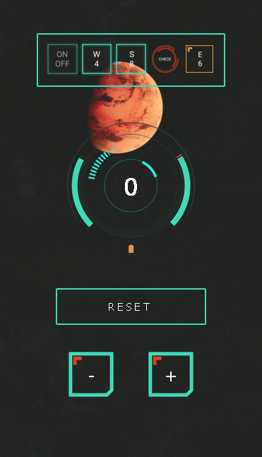

<p align="center"></p>
<h1 align="center">Progetto JavaScript - Counter</h1>

<h3 align="center">Antonio Michele Fano</h3>

<br>
<br>

- [Breve introduzione al design e alle funzionalità](#breve-introduzione-al-design-e-alle-funzionalità)
  - [Versione Desktop](#versione-desktop)
  - [Versione Mobile](#versione-mobile)
- [Architettura sito](#architettura-sito)
- [Installazione node-sass](#installazione-node-sass)

<br>
<br>

## Breve introduzione al design e alle funzionalità

<br>

- ### Design:

  - Il Design contiene elementi grafici futuristici.
    Il contatore presenta un display al centro, un pulsante con funzione di decremento a sinistra, un pulsante con funzione di incremento a destra e un pulsante addizionale di reset.

  - Il display è dinamico e interagisce con i bottoni al fine di creare un effetto "realistico". Ruota a seconda del bottone cliccato. Durante il reset l'animazione cambia.

  - In alto, prima del contatore c'è un elemento prettamente estetico e quindi non funzionale. Rappresenta una serie di pulsanti animati per simulare un'interfaccia moderna "touch".

<br>
<br>

### Versione Desktop

La versione Desktop mostra il contatore nella sua massima risoluzione e il layout è predisposto come segue nell'immagine:


<br>
<br>

### Versione Mobile

La versione mobile è ottimizzata per l'uso sul telefono. Il layout cambia diventando più compatto e funzionale. Il display sale di posizione lasciando lo spazio in basso a tutti i vari pulsanti.

<p align="center">

</p>

<br>

---

<br>

## Architettura sito

- All'interno della cartella "assets" troveremo:
  - css
    - `style.comp.css`
    - `style.css`
    - `style.prefix.css`
  - favicon
    - diversi file favicon per i browser
  - img
    - immagini
  - js
    - il file JavaScript: `script.js`
  - sass
    - abstracts
      - animations
      - responsive-breakpoints
      - variables
    - base
      - base
      - utilities (utility classes)
    - pages
      - home
    - `main.scss` (con la funzione di `@import`)
  - `package.json`
  - `package-lock.json`

<br>
<br>

## Installazione node-sass

All'interno della cartella assets è presente il file `package.json` quindi aprite Git Bash e dalla cartella assets eseguire:

```console
npm install node-sass --save-dev
```
